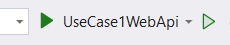
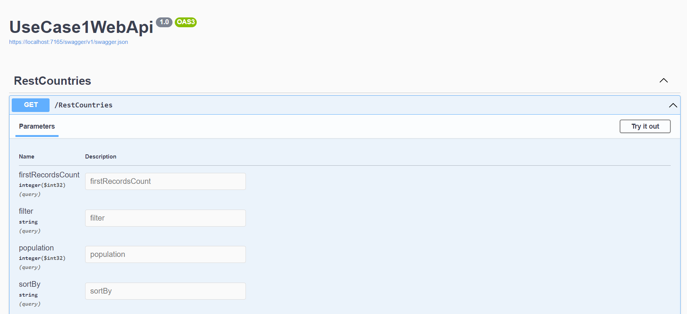
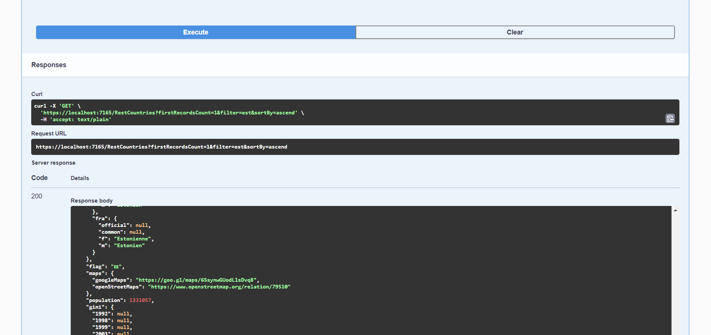

# UseCase1WebApi
The main function of this application is to retrive countries information from endpoint https://restcountries.com/v3.1/all. There is a possibility to filter and sort result by country common name, also filter data by population of the country. 

# Run the application
First of all, you need to copy repository to your computer. Open "UseCase1WebApi/UseCase1WebApi.sln" via Visual Studio 2022 and start debug.

No additional configurations are required.

# Application Testing

When Web Api is run correctly, you should see Swagger UI with one endpoint.

Here there is one required param - firstRecordsCount - used to retrieve only first N records.

Other params - filter, population, sortBy - are used to filer and sort result set. Pay attention, that population should be entered in million format. Possible values in sortBy field are "ascend" and "descend".

Ypu need to press "Try it out", enter input params and click "Execute". Your response will be displayed bellow.

